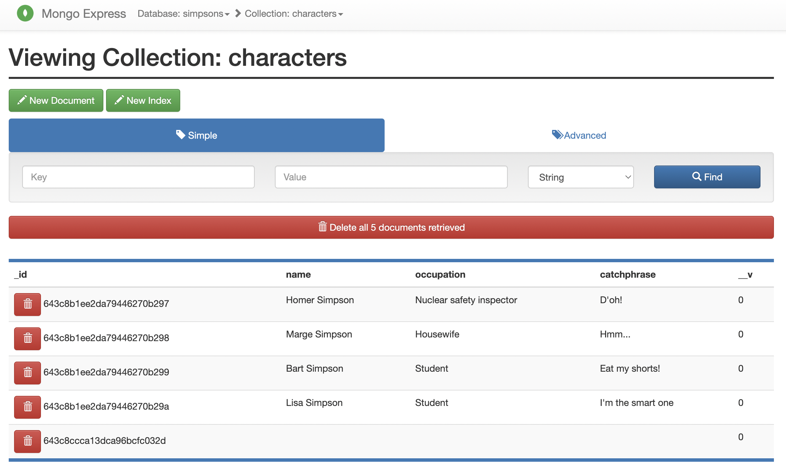

# Docker Compose Demo

## Table of Contents
- [Introduction](#introduction)
- [Prerequisites](#prerequisites)
- [Instructions](#instructions)

## Introduction

This is a simple repo to demonstrate how to use a Docker compose file. Please note this repo is still a work in progress. If you would like to build something similar, I would highly recommend the TechWorld with Nana Docker tutorial: https://youtu.be/3c-iBn73dDE

Please note I used the Docker Compose template provided from her repo as a starting point, but have updated how environment variables are being read.

## Prerequisites

Please have all of the following configured and ready to use on your local machine:

- [Docker](https://docs.docker.com/get-docker/)
- [direnv](https://direnv.net/)
- Terminal of your choice (I prefer [`iTerm2`](https://medium.com/ayuth/iterm2-zsh-oh-my-zsh-the-most-power-full-of-terminal-on-macos-bdb2823fb04c))

## Instructions

### Step 1 - Clone this repo to your machine

`git clone git@github.com:traviscancode604/docker-compose-demo.git`

### Step 2 - Change into the directory of the newly cloned Git repo

`cd docker-compose-demo`

### Step 3 - Allow `direnv` environment variables to be loaded

`direnv allow`

### Step 4 - Start up Docker Containers

When you're ready to run the containers, use this command:

`docker compose up`

### Step 5 - Stop Docker Containers
When you're ready to take the containers down, run this command:

`docker compose down`

## Work In Progress

    

I would like to make a small Express app to show off a basic web app beyond just MongoDB / Mongo Express.

Stay tuned!